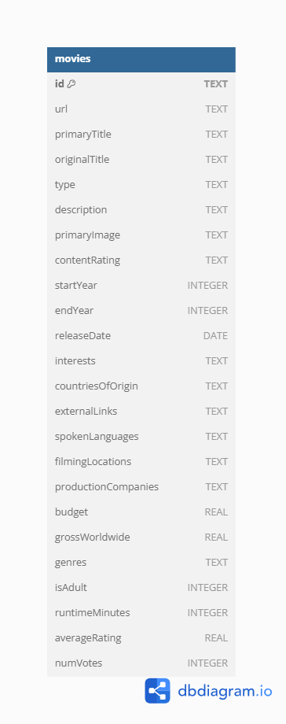

# IMDB ETL Pipeline

A data pipeline that extracts movie data from the IMDB API via RapidAPI, transforms it using Polars, and loads it into a a SQL database.

## Project Overview

This ETL (Extract, Transform, Load) pipeline fetches movie data from IMDB, processes it to create clean, structured datasets, and stores the results in a relational database. The pipeline follows software engineering best practices including automated testing, code formatting, type hinting, and dependency management with Poetry.




## Installation

### Prerequisites

- Python 3.10+
- Poetry

### Setup

1. Clone the repository:
```bash
git clone https://github.com/Zayneeh/zainab-etl-pipeline.git
cd zainab-etl-pipeline
```

2. Install dependencies with Poetry:
```bash
poetry install
```

3. Set up environment variables:
```bash
cp .env.example .env
# Edit .env file with your RapidAPI key and database credentials
```

## Usage

### Running the Pipeline

Execute the complete ETL pipeline:

```bash
poetry run python scripts/run_pipeline.py
```

### Individual Components

Run components separately for development or debugging:

```bash
# Extract data only
poetry run python -m src.web_scraper

# Transform data only
poetry run python -m src.data_transform

# Load data only
poetry run python -m src.db_loader
```

### Running Tests

```bash
poetry run pytest
```

## Data Flow

1. **Extraction**:
   - Connects to IMDB API via RapidAPI
   - Fetches top 250 movies and detailed information
   - Stores raw data in JSON format in `data/raw_data.json`

2. **Transformation**:
   - Loads raw JSON data into Polars DataFrames
   - Cleans and normalizes data (dates, numeric values, text)
   - Handles missing values and duplicates
   - Creates relationship tables
   - Stores processed data in Parquet format in `data/processed_data.parquet`

3. **Loading**:
   - Establishes connection to SQL database
   - Creates tables if they don't exist
   - Loads transformed data into respective tables
   - Verifies data integrity


### Project Structure

```
etl_pipeline/
├── .gitignore
├── README.md
├── pyproject.toml
├── poetry.lock
├── src/
│   ├── __init__.py
│   ├── web_scraper.py
│   ├── data_transform.py
│   ├── db_loader.py
├── tests/
│   ├── __init__.py
│   ├── test_scraper.py
│   ├── test_transform.py
│   ├── test_db_loader.py
├── notebooks/
│   └── exploration.ipynb
├── data/
│   ├── raw_data.json
│   └── processed_data.parquet
├── docs/
│   └── erd_diagram.png
└── scripts/
    └── run_pipeline.py
```

## Demo

<<<<<<< HEAD
[Link to Demo Video](https://youtu.be/yourdemolink)
